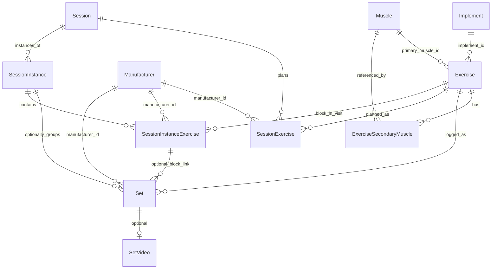

# Your Set — Data Model

## Overview

Local SQLite database, single-user, no sync in MVP. All entities use string **UUID** primary keys (RFC 4122, generated via `expo-crypto` `randomUUID()`). Datetimes stored as **ISO 8601** `TEXT`.

**Set-centric:** the **set** is the atomic log entry. **Session instances are optional.** Every set has a canonical **`performedAt`** — never inferred from the session.

## Architecture — source of truth

This doc and **`types/domain.ts`** describe the **product model** (what entities exist and how they relate). The **on-device database** is created at app startup, not from a separate migration CLI on the phone.

| Layer | Location | Role |
|-------|----------|------|
| **Domain types (app)** | `types/domain.ts` | TypeScript shapes the UI and services use (`Exercise`, `SessionInstance`, `Set`, …). IDs are `string` because UUIDs are serialized as text in JS/SQLite/JSON. |
| **SQLite rows** | `lib/db/row-types.ts` | Snake_case column shapes returned by `expo-sqlite`. |
| **Row ↔ domain** | `lib/db/map-row.ts` | Maps DB rows to `domain.ts` (and dual-writes legacy `workout_*` columns on `sets` where needed). |
| **Repositories** | `lib/db/repositories/*.ts` | CRUD and queries per table. |
| **Reference SQL** | `lib/db/queries.ts` | Canonical query patterns (not executed as a single script). |
| **Schema migrations** | `lib/db/migrations/001-initial.ts`, `002-sessions.ts` | **Authoritative DDL** run by `lib/db/client.ts` via `db.execAsync()`. |
| **Human-readable SQL** | `lib/db/migrations/001_initial.sql` | Documentation only for v1; **do not assume it matches production** after migration 002 (still shows old `workouts` tables). |

### How tables are created on the phone

1. `app/_layout.tsx` wraps the app in `DatabaseProvider` (`lib/db/database-provider.tsx`).
2. On launch: `initDatabase()` opens `your-set.db`, ensures `schema_migrations` exists, then runs pending migrations in order.
3. `seedDatabaseIfEmpty()` inserts demo data if `exercises` is empty.

No Entity Framework or external SQL runner on device — only versioned SQL strings embedded in TypeScript.

### IDs across languages (e.g. future C# / EF)

The **identifier value** stays the same UUID everywhere; only the **language type** changes:

| Environment | Typical type | Storage |
|-------------|--------------|---------|
| TypeScript (this app) | `string` | SQLite `TEXT` |
| JSON API | `string` | — |
| C# + EF | `Guid` | SQL Server `uniqueidentifier`, or `TEXT` in SQLite/Postgres |

A future backend would add its own entities and EF migrations against the **same schema and UUIDs**; it would not replace `types/domain.ts` in the Expo app. Both codebases implement one model.

### UI naming vs tables

| UI | DB table | Domain type |
|----|----------|-------------|
| **Sessions** tab | `sessions` | `Session` (definition) |
| **Workouts** tab | `session_instances` | `SessionInstance` (one gym visit) |
| **Exercises** tab | `exercises` (+ `implements` / `muscles` / `manufacturers`) | `Exercise` |

## Design principles

| Principle | Detail |
|-----------|--------|
| Set-first | Query all sets for an exercise by `performed_at`, weight, reps, etc. |
| Session-optional | `sets.session_instance_id` may be `NULL` — set-only logging is valid |
| Optional end | `session_instances.ended_at` is nullable; never required to save or view sets |
| One time field | `performedAt` on the set is what UI and filters use for “when” |

## Entity relationship (schema v9)

The exercise/variant split was collapsed in v5 — the **exercise is the single
loggable unit**. Free-text muscle/equipment became foreign keys to seeded
reference tables, with secondary muscles in a join table. In v6, manufacturer
(equipment brand) moved to the **set**, recorded per log. In v7–v8, `set_type`,
`rir`, and any multi-bout rep storage were dropped — v1 logging is **weight ×
reps** only. Extra context (RIR, cluster notes, etc.) belongs in notes/tags
later. Manufacturer dropdown is surfaced only for Machine and Smith machine.

## Three query modes

### 1. Set-first (exercise)

All sets for a movement, **with or without** a session instance. Filter by date range, weight, reps.

- By exercise ID: `WHERE exercise_id = ?`
- Order: `performed_at DESC`

See `lib/db/queries.ts` → `SQL_SETS_BY_EXERCISE`.

### 2. Session-instance-first

All sets and exercise blocks for one visit.

- Sets: `WHERE COALESCE(session_instance_id, workout_id) = ?` (legacy column during transition)
- Blocks: `session_instance_exercises WHERE session_instance_id = ?`

See `SQL_SETS_BY_SESSION_INSTANCE`, `SQL_INSTANCE_EXERCISES_BY_INSTANCE`.

### 3. Exercise within one instance

Sets for one exercise **in** one visit.

- `WHERE session_instance_id = ? AND exercise_id = ?`

See `SQL_SETS_BY_SESSION_INSTANCE_AND_EXERCISE`.

## Entities

### Reference lookups (stock)

Seeded by migration 005. Shared, read-mostly catalog data.

- **`implements`** — `id`, `name`, `sort_order` (barbell, dumbbell, machine, cable, smith, bodyweight, …).
- **`muscles`** — `id`, `name`, `region`, `sort_order` (chest, lats, quads, …). `region` groups muscles for future rollups.
- **`manufacturers`** — `id`, `name` (Hammer Strength, Nautilus, …); accounts for machine variations.

### Exercise

The **single loggable movement** (e.g. “Smith high incline press”). Sets log directly to an exercise. Variants were folded into this in v5.

| Field (domain) | SQL column | Type | Notes |
|----------------|------------|------|-------|
| id | id | TEXT PK | UUID |
| name | name | TEXT | Required |
| implementId | implement_id | TEXT FK | → implements.id; nullable |
| primaryMuscleId | primary_muscle_id | TEXT FK | → muscles.id; nullable |
| origin | origin | TEXT | `stock` \| `custom`; seam for shared library |
| catalogId | catalog_id | TEXT | nullable; stock row a custom copy derives from |
| notes | notes | TEXT | nullable (setup notes) |
| createdAt / updatedAt | … | TEXT | ISO datetime |

`implement` / `primaryMuscle` are nullable so users can jot a name on the fly; anything promoted into the shared library should set both.

Table: `exercises`. Referenced by `sets.exercise_id`, session planned/instance blocks, etc.

**Secondary muscles** live in a join table `exercise_secondary_muscles` (`exercise_id`, `muscle_id`, PK both) — queryable ("all exercises that hit biceps") and FK-safe, rather than a comma-list.

#### Library at scale (future cloud)

User-created exercises stay in the **same** `exercises` table with a discriminator (`origin`, plus a server-side `owner_user_id`) — never per-user tables. The global library is `origin='stock'` / `owner_user_id IS NULL`; reads filter `owner_user_id = :me OR owner_user_id IS NULL`. Sets shard by `user_id` (composite index `(user_id, exercise_id, performed_at)`); no cross-user joins, so it partitions cleanly to billions of rows.

### Session (definition)

Repeatable rotation slot (e.g. “Push A”). **Not** a specific gym day.

| Field | Type | Notes |
|-------|------|-------|
| id | TEXT PK | UUID |
| name | TEXT | Required |
| status | TEXT | `active` \| `retired` |
| rotationSortOrder | INTEGER | Nullable; order in rotation UI |
| notes | TEXT | Nullable |
| createdAt / updatedAt | TEXT | ISO |

Table: `sessions`.

### SessionExercise (planned lineup)

Default prescriptions for a definition. Copied into instance blocks when starting a visit.

| Field | Type | Notes |
|-------|------|-------|
| id | TEXT PK | UUID |
| sessionId | TEXT FK | → sessions |
| exerciseId | TEXT FK | → exercises |
| sortOrder | INTEGER | Order in session |
| targetSets | INTEGER | Nullable |
| targetRepsMin / targetRepsMax | INTEGER | Nullable |
| targetWeight | REAL | Nullable |
| manufacturerId | TEXT FK | → manufacturers; nullable — default brand for this movement in the session |
| prescriptionNotes | TEXT | Nullable |

Table: `session_exercises`.

### SessionInstance (one visit)

| Field | Type | Notes |
|-------|------|-------|
| id | TEXT PK | UUID |
| sessionId | TEXT FK | Nullable — ad-hoc visit has no definition |
| startedAt | TEXT | Required |
| endedAt | TEXT | **Nullable** |
| bodyweight | REAL | Nullable |
| notes | TEXT | Nullable |
| editingUnlocked | INTEGER | 0/1 — when ended, must be 1 to allow set edits without changing start/end times |

Table: `session_instances` (migrated from `workouts` in 002).

### SessionInstanceExercise (block in a visit)

| Field | Type | Notes |
|-------|------|-------|
| id | TEXT PK | UUID |
| sessionInstanceId | TEXT FK | → session_instances |
| exerciseId | TEXT FK | → exercises |
| sortOrder | INTEGER | |
| manufacturerId | TEXT FK | → manufacturers; nullable — workout-level default for sets in this block |
| notes | TEXT | Nullable |

Table: `session_instance_exercises`.

### Set

| Field | Type | Notes |
|-------|------|-------|
| exerciseId | TEXT FK | → exercises (required) |
| manufacturerId | TEXT FK | → manufacturers.id; nullable — equipment brand **for this log** (machine / Smith only in v1 UI) |
| sessionInstanceId | TEXT FK | Nullable |
| sessionInstanceExerciseId | TEXT FK | Nullable; requires instance id |
| performedAt | TEXT | **Canonical time** — editable in the UI |
| weight | REAL | Nullable |
| reps | INTEGER | Nullable |

As of v5, `sets.exercise_id` references `exercises` directly (no variant layer). As of v6, `manufacturer_id` lives on the set, not the exercise. As of v7–v8, `set_type` and `rir` are gone; v1 is weight × reps only.

### SetVideo

Unchanged.

## Migrations

| Version | File (runtime) | Summary |
|---------|----------------|---------|
| 1 | `lib/db/migrations/001-initial.ts` | Exercises, variants, legacy `workouts` / `workout_exercises`, sets, set_videos |
| 2 | `lib/db/migrations/002-sessions.ts` | `sessions`, `session_exercises`, `session_instances`, `session_instance_exercises`; migrates old workout rows; adds `sets.session_instance_id` |
| 3 | `lib/db/migrations/003-sets-drop-legacy-workout-fks.ts` | Rebuilds `sets` without `workout_id` / `workout_exercise_id` FKs (fixes inserts after 002) |

After v2, `lib/db/migrate-data-v2.ts` groups legacy instance names into `sessions` rows (`legacy_name:` in notes).

| 4 | `lib/db/migrations/004-drop-set-failure-flag.ts` | Drops `is_failure` from `sets` |
| 5 | `lib/db/migrations/005-exercises-flatten.ts` | Collapses `exercise_variants` into `exercises`; adds `implements` / `muscles` / `manufacturers` (seeded) + `exercise_secondary_muscles`; remaps `sets` / session FKs to `exercise_id`. Pre-release data is dropped and reseeded. |
| 6 | `lib/db/migrate-data-v6.ts` (`applyMigration006`) | Moves `manufacturer_id` from `exercises` to `sets`; idempotent if a prior partial run left `*_v6` temp tables |

`schema_migrations.version` tracks applied versions. Current target: **6** (`SCHEMA_VERSION` in `lib/db/client.ts`).

## TypeScript mapping

`types/domain.ts` — all domain entities. Repositories under `lib/db/repositories/`.
