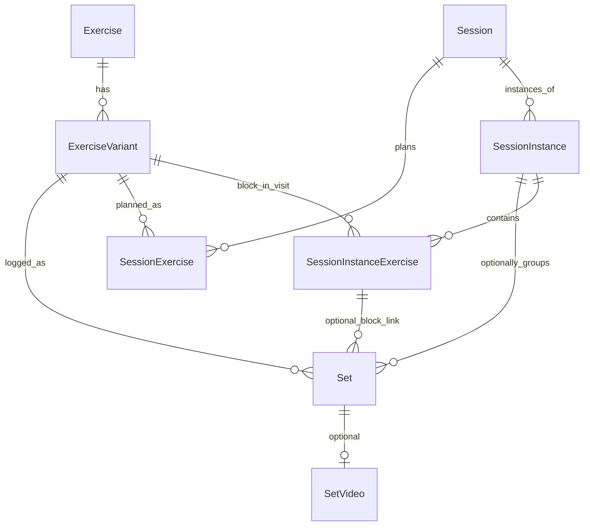

# Your Set — Data Model

## Overview

Local SQLite database, single-user, no sync in MVP. All entities use string **UUID** primary keys (RFC 4122, generated via `expo-crypto` `randomUUID()`). Datetimes stored as **ISO 8601** `TEXT`.

**Set-centric:** the **set** is the atomic log entry. **Session instances are optional.** Every set has a canonical **`performedAt`** — never inferred from the session.

## Architecture — source of truth

This doc and **`types/domain.ts`** describe the **product model** (what entities exist and how they relate). The **on-device database** is created at app startup, not from a separate migration CLI on the phone.

| Layer | Location | Role |
|-------|----------|------|
| **Domain types (app)** | `types/domain.ts` | TypeScript shapes the UI and services use (`Exercise`, `SessionInstance`, `Set`, …). IDs are `string` because UUIDs are serialized as text in JS/SQLite/JSON. |
| **SQLite rows** | `lib/db/row-types.ts` | Snake_case column shapes returned by `expo-sqlite`. |
| **Row ↔ domain** | `lib/db/map-row.ts` | Maps DB rows to `domain.ts` (and dual-writes legacy `workout_*` columns on `sets` where needed). |
| **Repositories** | `lib/db/repositories/*.ts` | CRUD and queries per table. |
| **Reference SQL** | `lib/db/queries.ts` | Canonical query patterns (not executed as a single script). |
| **Schema migrations** | `lib/db/migrations/001-initial.ts`, `002-sessions.ts` | **Authoritative DDL** run by `lib/db/client.ts` via `db.execAsync()`. |
| **Human-readable SQL** | `lib/db/migrations/001_initial.sql` | Documentation only for v1; **do not assume it matches production** after migration 002 (still shows old `workouts` tables). |

### How tables are created on the phone

1. `app/_layout.tsx` wraps the app in `DatabaseProvider` (`lib/db/database-provider.tsx`).
2. On launch: `initDatabase()` opens `your-set.db`, ensures `schema_migrations` exists, then runs pending migrations in order.
3. `seedDatabaseIfEmpty()` inserts demo data if `exercises` is empty.

No Entity Framework or external SQL runner on device — only versioned SQL strings embedded in TypeScript.

### IDs across languages (e.g. future C# / EF)

The **identifier value** stays the same UUID everywhere; only the **language type** changes:

| Environment | Typical type | Storage |
|-------------|--------------|---------|
| TypeScript (this app) | `string` | SQLite `TEXT` |
| JSON API | `string` | — |
| C# + EF | `Guid` | SQL Server `uniqueidentifier`, or `TEXT` in SQLite/Postgres |

A future backend would add its own entities and EF migrations against the **same schema and UUIDs**; it would not replace `types/domain.ts` in the Expo app. Both codebases implement one model.

### UI naming vs tables

| UI | DB table | Domain type |
|----|----------|-------------|
| **Sessions** tab | `sessions` | `Session` (definition) |
| **Workouts** tab | `session_instances` | `SessionInstance` (one gym visit) |
| **Exercises** tab | `exercises` / `exercise_variants` | `Exercise` / `ExerciseVariant` |

## Design principles

| Principle | Detail |
|-----------|--------|
| Set-first | Query all sets for a variant (or exercise) by `performed_at`, weight, reps, etc. |
| Session-optional | `sets.session_instance_id` may be `NULL` — set-only logging is valid |
| Optional end | `session_instances.ended_at` is nullable; never required to save or view sets |
| One time field | `performedAt` on the set is what UI and filters use for “when” |

## Entity relationship (schema v2)

## Three query modes

### 1. Set-first (variant or exercise)

All sets for a movement, **with or without** a session instance. Filter by date range, weight, reps, set type.

- By variant ID: `WHERE exercise_variant_id = ?`
- By parent exercise ID: join `exercise_variants` on `exercise_id = ?`
- Order: `performed_at DESC`

See `lib/db/queries.ts` → `SQL_SETS_BY_VARIANT`, `SQL_SETS_BY_EXERCISE`.

### 2. Session-instance-first

All sets and exercise blocks for one visit.

- Sets: `WHERE COALESCE(session_instance_id, workout_id) = ?` (legacy column during transition)
- Blocks: `session_instance_exercises WHERE session_instance_id = ?`

See `SQL_SETS_BY_SESSION_INSTANCE`, `SQL_INSTANCE_EXERCISES_BY_INSTANCE`.

### 3. Variant within one instance

Sets for one variant **in** one visit.

- `WHERE session_instance_id = ? AND exercise_variant_id = ?`

See `SQL_SETS_BY_SESSION_INSTANCE_AND_VARIANT`.

## Entities

### Exercise

Broad movement category (e.g. “Incline Press”). Sets are **not** logged directly to exercises.

| Field (domain) | SQL column | Type | Notes |
|----------------|------------|------|-------|
| id | id | TEXT PK | UUID |
| name | name | TEXT | Required |
| defaultMuscleGroup | default_muscle_group | TEXT | Nullable |
| createdAt | created_at | TEXT | ISO datetime |
| updatedAt | updated_at | TEXT | ISO datetime |

Table: `exercises`. Deleting an exercise **cascades** to its variants (`ON DELETE CASCADE`).

### ExerciseVariant

Specific setup under an exercise — the unit for set-first history and logging (e.g. “Smith high incline”).

| Field (domain) | SQL column | Type | Notes |
|----------------|------------|------|-------|
| id | id | TEXT PK | UUID |
| exerciseId | exercise_id | TEXT FK | → exercises.id |
| name | name | TEXT | Required |
| muscleGroup | muscle_group | TEXT | Nullable |
| equipment | equipment | TEXT | Nullable |
| setupNotes | setup_notes | TEXT | Nullable |
| createdAt | created_at | TEXT | ISO datetime |
| updatedAt | updated_at | TEXT | ISO datetime |

Table: `exercise_variants`. Referenced by `sets.exercise_variant_id`, session planned/instance blocks, etc.

### Session (definition)

Repeatable rotation slot (e.g. “Push A”). **Not** a specific gym day.

| Field | Type | Notes |
|-------|------|-------|
| id | TEXT PK | UUID |
| name | TEXT | Required |
| status | TEXT | `active` \| `retired` |
| rotationSortOrder | INTEGER | Nullable; order in rotation UI |
| notes | TEXT | Nullable |
| createdAt / updatedAt | TEXT | ISO |

Table: `sessions`.

### SessionExercise (planned lineup)

Default prescriptions for a definition. Copied into instance blocks when starting a visit.

| Field | Type | Notes |
|-------|------|-------|
| id | TEXT PK | UUID |
| sessionId | TEXT FK | → sessions |
| exerciseVariantId | TEXT FK | → exercise_variants |
| sortOrder | INTEGER | Order in session |
| targetSets | INTEGER | Nullable |
| targetRepsMin / targetRepsMax | INTEGER | Nullable |
| targetWeight | REAL | Nullable |
| prescriptionNotes | TEXT | Nullable |

Table: `session_exercises`.

### SessionInstance (one visit)

| Field | Type | Notes |
|-------|------|-------|
| id | TEXT PK | UUID |
| sessionId | TEXT FK | Nullable — ad-hoc visit has no definition |
| startedAt | TEXT | Required |
| endedAt | TEXT | **Nullable** |
| bodyweight | REAL | Nullable |
| notes | TEXT | Nullable |

Table: `session_instances` (migrated from `workouts` in 002).

### SessionInstanceExercise (block in a visit)

| Field | Type | Notes |
|-------|------|-------|
| id | TEXT PK | UUID |
| sessionInstanceId | TEXT FK | → session_instances |
| exerciseVariantId | TEXT FK | |
| sortOrder | INTEGER | |
| notes | TEXT | Nullable |

Table: `session_instance_exercises` (migrated from `workout_exercises`).

### Set

| Field | Type | Notes |
|-------|------|-------|
| sessionInstanceId | TEXT FK | Nullable |
| sessionInstanceExerciseId | TEXT FK | Nullable; requires instance id |
| performedAt | TEXT | **Canonical time** |
| … | | weight, reps, rir, set_type, etc. |

Legacy columns `workout_id` / `workout_exercise_id` may remain on upgraded DBs; app reads/writes `session_instance_*` and dual-writes legacy columns for CHECK compatibility.

### SetVideo

Unchanged.

## Migrations

| Version | File (runtime) | Summary |
|---------|----------------|---------|
| 1 | `lib/db/migrations/001-initial.ts` | Exercises, variants, legacy `workouts` / `workout_exercises`, sets, set_videos |
| 2 | `lib/db/migrations/002-sessions.ts` | `sessions`, `session_exercises`, `session_instances`, `session_instance_exercises`; migrates old workout rows; adds `sets.session_instance_id` |

After v2, `lib/db/migrate-data-v2.ts` groups legacy instance names into `sessions` rows (`legacy_name:` in notes).

`schema_migrations.version` tracks applied versions. Current target: **2** (`SCHEMA_VERSION` in `lib/db/client.ts`).

## TypeScript mapping

`types/domain.ts` — all domain entities. Repositories under `lib/db/repositories/`.
