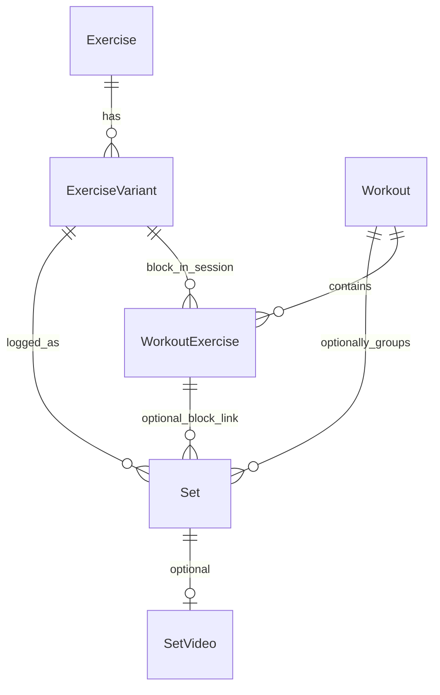
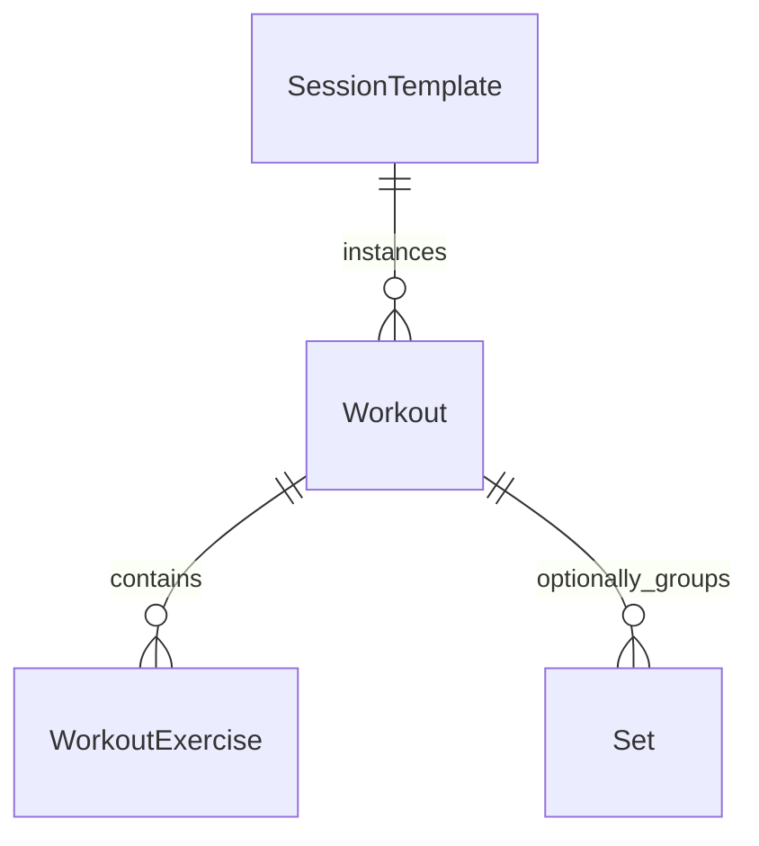

# Your Set — Data Model

## Overview

Local SQLite database, single-user, no sync in MVP. All entities use string **UUID** primary keys. Datetimes stored as **ISO 8601** `TEXT`.

**Set-centric:** the **set** is the atomic log entry. **Sessions (`workouts`) are optional.** Every set has a canonical **`performedAt`** — never inferred from the session.

## Design principles

| Principle | Detail |
|-----------|--------|
| Set-first | Query all sets for a variant (or exercise) by `performed_at`, weight, reps, etc. |
| Session-optional | `sets.workout_id` may be `NULL` — set-only logging is valid |
| Optional end | `workouts.ended_at` is nullable; never required to save or view sets |
| One time field | `performedAt` on the set is what UI and filters use for “when” |

## Entity relationship

## Three query modes

### 1. Set-first (variant or exercise)

All sets for a movement, **with or without** a session. Filter by date range, weight, reps, set type.

- By variant ID: `WHERE exercise_variant_id = ?`
- By parent exercise ID: join `exercise_variants` on `exercise_id = ?`
- Order: `performed_at DESC`
- Filters: `performed_at`, `weight`, `reps`, `set_type`

See `lib/db/queries.ts` → `SQL_SETS_BY_VARIANT`, `SQL_SETS_BY_EXERCISE`.

### 2. Session-first

All sets and exercise blocks for one workout.

- Sets: `WHERE workout_id = ?` ORDER BY `performed_at`
- Blocks: `workout_exercises WHERE workout_id = ?` ORDER BY `sort_order`

See `SQL_SETS_BY_WORKOUT`, `SQL_WORKOUT_EXERCISES_BY_WORKOUT`.

### 3. Variant within a session

Sets for one variant **in** one session.

- `WHERE workout_id = ? AND exercise_variant_id = ?`

See `SQL_SETS_BY_WORKOUT_AND_VARIANT`.

## Entities

### Exercise

Broad movement category.

| Field | Type | Notes |
|-------|------|-------|
| id | TEXT PK | UUID |
| name | TEXT | Required |
| defaultMuscleGroup | TEXT | Nullable |
| createdAt | TEXT | ISO datetime |
| updatedAt | TEXT | ISO datetime |

### ExerciseVariant

Specific setup under an exercise (primary “movement” for set-first queries).

| Field | Type | Notes |
|-------|------|-------|
| id | TEXT PK | UUID |
| exerciseId | TEXT FK | → Exercise.id |
| name | TEXT | Required |
| muscleGroup | TEXT | Nullable |
| equipment | TEXT | Nullable |
| setupNotes | TEXT | Nullable |
| createdAt | TEXT | |
| updatedAt | TEXT | |

### Workout (session **instance**)

One gym visit — a single occurrence in time. **Not** the same as a repeating program day (see **SessionTemplate** below).

| Field | Type | Notes |
|-------|------|-------|
| id | TEXT PK | UUID |
| name | TEXT | Nullable — **legacy / convenience only today**; see gap note below |
| startedAt | TEXT | Required when session exists |
| endedAt | TEXT | **Nullable** — explicit “End” only; never required |
| bodyweight | REAL | Nullable |
| notes | TEXT | Nullable |
| createdAt | TEXT | |
| updatedAt | TEXT | |

#### Current gap (pre–template migration)

| Need | Today |
|------|--------|
| Name a session | `workouts.name` column exists; seed sets `"Push A"`; **no UI** to name or rename on start/detail |
| Many instances of “Push A” | Each row is independent; duplicate `name` strings are **not** linked — **not** true template → instances |
| Active vs retired rotation | **Not modeled** — all instances appear in one list |

### SessionTemplate (planned — migration 002)

The **definition** of a repeatable session (e.g. “Push A”) — your microcycle slot, not a specific day.

| Field | Type | Notes |
|-------|------|-------|
| id | TEXT PK | UUID |
| name | TEXT | Required; user-facing label (“Push A”, “Legs A”) |
| status | TEXT | `active` \| `retired` — rotation membership |
| rotationSortOrder | INTEGER | Nullable; order in active microcycle shortlist |
| notes | TEXT | Nullable; program notes for this slot |
| createdAt | TEXT | |
| updatedAt | TEXT | |

**Active** templates = current rotation (weekly or user-defined cycle). **Retired** = no longer in rotation but history preserved; user can still open past **instances**.

**Workout** (instance) will gain:

| Field | Type | Notes |
|-------|------|-------|
| sessionTemplateId | TEXT FK | Nullable — links instance to template; `NULL` = ad-hoc session |

Display name for an instance: `SessionTemplate.name` + instance date (drop duplicate `workouts.name` over time or keep as one-time override).

**Flows (planned):**

- **Start Push A** → create new `Workout` with `sessionTemplateId` = Push A template, `startedAt` = now
- **Push A next week** → another `Workout` row, same `sessionTemplateId`
- **Retire Push A** → template `status = retired`; past instances unchanged; hidden from “Start” shortlist, visible under Retired / history

### WorkoutExercise

Optional block within a session (order, block notes). **Not required** to log a set.

| Field | Type | Notes |
|-------|------|-------|
| id | TEXT PK | UUID |
| workoutId | TEXT FK | → Workout.id |
| exerciseVariantId | TEXT FK | → ExerciseVariant.id |
| sortOrder | INTEGER | Order in session UI |
| notes | TEXT | Nullable block notes |
| createdAt | TEXT | |
| updatedAt | TEXT | |

### Set

**Atomic log entry.**

| Field | Type | Notes |
|-------|------|-------|
| id | TEXT PK | UUID |
| exerciseVariantId | TEXT FK | **Required** |
| performedAt | TEXT | **Required** — when the set was performed (filters, history, compare) |
| workoutId | TEXT FK | **Nullable** — session link |
| workoutExerciseId | TEXT FK | **Nullable** — block link; requires `workoutId` if set |
| sortOrder | INTEGER | Nullable — order within session block |
| weight | REAL | Nullable |
| reps | INTEGER | Nullable |
| rir | INTEGER | Nullable |
| isFailure | INTEGER | 0/1 |
| setType | TEXT | Enum below |
| notes | TEXT | Nullable |
| createdAt | TEXT | When row was created in app (audit / late logging) |
| updatedAt | TEXT | |

**Integrity:** `CHECK (workout_exercise_id IS NULL OR workout_id IS NOT NULL)`

#### setType enum

`straight` | `top_set` | `backoff` | `rest_pause` | `myo_rep` | `cluster` | `drop_set` | `partials` | `bfr` | `forced_reps` | `other`

### SetVideo

Unchanged — 0..1 per set for MVP. See previous spec for fields.

## SQLite schema

Full script: [`lib/db/migrations/001_initial.sql`](../lib/db/migrations/001_initial.sql)

Key indexes:

- `idx_sets_variant_performed` — set-first history
- `idx_sets_workout` — session-first
- `idx_sets_performed` — global timeline

## TypeScript

- Domain types: [`types/domain.ts`](../types/domain.ts)
- `SetListFilters` for query (1) filters
- Row mapping: [`lib/db/map-row.ts`](../lib/db/map-row.ts)
- Validation helper: [`types/set-validation.ts`](../types/set-validation.ts)

## Session end behavior

- **End** sets `workouts.ended_at` only.
- Sets logged before or after remain valid.
- Open sessions (`ended_at IS NULL`) may stay open indefinitely.
- “Active workout” UI is a product rule (e.g. latest open session with recent sets), not a schema requirement.

## Mock data (Phase 1)

Includes session-linked sets and **`set-orphan-smith`** — a set with `workoutId: null` for set-only path testing in variant history.

## Future sync

- UUID ids; optional `deleted_at` / `sync_version` later
- Do not store video blobs in SQLite
